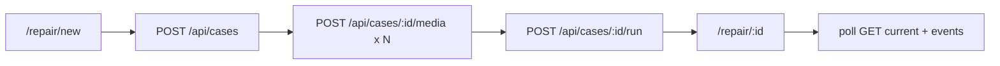

# Repair Desk E2E Implementation Plan (post–`origin` refresh)

## Goal
Finish the end-to-end Repair Desk product path on top of the current repo: intake creates case **with media**, starts a council run, `/repair/[id]` reflects real state for that id, follow-up and verdict/action plan work, and `/dashboard` reflects the same source of truth as the Repair APIs—while preserving the existing `/repair/[id]` visual baseline.

## Post–`origin` baseline (what already landed)
Do **not** re-implement these unless a gap is found; extend or fix in place.

- **Canonical case APIs** under [app/api/cases/](app/api/cases/): `route.ts` (`GET`/`POST`), `[id]/route.ts`, `[id]/media/route.ts`, `[id]/run/route.ts`, `[id]/runs/[runId]/followup/route.ts`, `[id]/current/route.ts`, `[id]/events/route.ts`. Handlers use Web `Response.json`, dynamic `params: Promise<...>`, and shared helpers (see [node_modules/next/dist/docs/01-app/03-api-reference/03-file-conventions/route.md](node_modules/next/dist/docs/01-app/03-api-reference/03-file-conventions/route.md)).
- **Typed browser client**: [lib/api/client.ts](lib/api/client.ts) (`createCase`, `createMedia`, `startRun`, `getCurrentCase`, `getEvents`, `submitFollowup`, etc.).
- **Demo persistence + queries**: [lib/db/demo-store.ts](lib/db/demo-store.ts), [lib/db/queries/](lib/db/queries/) (`cases`, `runs`, `events`, `outputs`, `current`), [lib/db/locks.ts](lib/db/locks.ts).
- **Orchestrator + agents**: [lib/agents/orchestrator.ts](lib/agents/orchestrator.ts), `intake.ts`, `diagnosis.ts`, `economics.ts`, `action-plan.ts`, `helper-routing.ts`, [lib/agents/mock-provider.ts](lib/agents/mock-provider.ts), [lib/agents/model-router.ts](lib/agents/model-router.ts) (note: file is `model-router.ts`, not `model-routing.ts`).
- **Shared types**: [lib/types/case.ts](lib/types/case.ts), [lib/types/api.ts](lib/types/api.ts), [lib/types/agents.ts](lib/types/agents.ts), [lib/types/payloads.ts](lib/types/payloads.ts).
- **Fixtures**: [tests/fixtures/demo-cases.ts](tests/fixtures/demo-cases.ts), [tests/fixtures/demo-events.ts](tests/fixtures/demo-events.ts).
- **Vitest**: [package.json](package.json) scripts `test` / `test:watch`, [vitest.config.ts](vitest.config.ts) (node environment; `tests/**/*.test.ts`).
- **Intake route exists**: [app/repair/new/page.tsx](app/repair/new/page.tsx) — creates a case via `createCase` and redirects to `/repair/[id]`, but **does not** yet call `createMedia` or `startRun`.
- **Workspace is largely live**: [app/repair/[id]/page.tsx](app/repair/[id]/page.tsx) uses `useParams`, [hooks/useCaseRun.ts](hooks/useCaseRun.ts) (polls `current` + `events` every 2s), [hooks/useFollowUp.ts](hooks/useFollowUp.ts); agent board maps from `case_events` with the visual contract preserved.
- **Dashboard is partially live but not API-driven**: [app/dashboard/page.tsx](app/dashboard/page.tsx) uses [lib/db/repair/cases.ts](lib/db/repair/cases.ts) + [lib/server/auth.ts](lib/server/auth.ts) (`getUser`) — **not** `GET /api/cases` from the client.
- **Auth for Repair APIs**: [lib/auth/demo-user.ts](lib/auth/demo-user.ts) `getRequestUserId` — demo user when Supabase is unavailable; Bearer JWT when Supabase is configured. This supersedes the older community-only `x-demo-user-id` pattern for the Diagnose routes (community APIs under [app/api/helper-requests/](app/api/helper-requests/) may still use [lib/auth/current-user.ts](lib/auth/current-user.ts)).

## Source docs (still authoritative)
- [docs/plan/platform-feature-contracts.md](docs/plan/platform-feature-contracts.md)
- [docs/roles/agents.md](docs/roles/agents.md)
- [docs/roles/frontend.md](docs/roles/frontend.md)
- [docs/plan/architecture.md](docs/plan/architecture.md)
- [docs/plan/custom-agents-context.md](docs/plan/custom-agents-context.md)
- [docs/plan/agent-council-backend-implementation-metaprompt.md](docs/plan/agent-council-backend-implementation-metaprompt.md)
- [docs/superpowers/specs/2026-04-22-bronco-repair-desk-design.md](docs/superpowers/specs/2026-04-22-bronco-repair-desk-design.md)
- [README.md](README.md) (note: text may still describe “UI prototype”; update when E2E is complete)

## Architecture (delta from original plan)
The layered architecture from the original plan is **already implemented** in code shape: Zod at API boundaries, orchestrator behind `POST /api/cases/[id]/run`, polling-first UI via `useCaseRun`, mock provider when no `GOOGLE_API_KEY`.

Remaining product wiring:

## Technical decisions (refresh)
- **Persistence**: Prefer extending [lib/db/demo-store.ts](lib/db/demo-store.ts) and query modules for any new fields or seed behavior; keep Postgres/Supabase DDL as a follow-on where the repo already uses Supabase for dashboard reads ([lib/db/repair/cases.ts](lib/db/repair/cases.ts)).
- **Testing**: Use existing Vitest (`npm test`). In-process E2E already lives under [tests/e2e/demo-flow.test.ts](tests/e2e/demo-flow.test.ts) and [tests/e2e/followup-flow.test.ts](tests/e2e/followup-flow.test.ts)—extend these rather than introducing a second harness unless Playwright is explicitly added.
- **Component tests**: `@testing-library/react` is **not** in [package.json](package.json); add only if a task needs DOM-level assertions—otherwise prefer route/integration tests and hooks tested via behavior in pages.
- **Smoke script**: `smoke:repair-desk` is not defined today; either add `scripts/smoke-repair-desk.ts` + npm script **or** document `npm test tests/e2e` as the smoke entrypoint in the final verification report.
- **Category naming drift**: Code and UI use `scooter` ([app/repair/new/page.tsx](app/repair/new/page.tsx), API Zod in [app/api/cases/route.ts](app/api/cases/route.ts)); contracts/docs often say `e_scooter`. Plan must either map at API boundary or rename consistently in a single coordinated change (announce-first if types freeze).

## File map (exists vs remaining work)

| Area | Status | Primary paths |
|------|--------|-----------------|
| Case API | Shipped | [app/api/cases/](app/api/cases/) |
| API client | Shipped | [lib/api/client.ts](lib/api/client.ts) |
| Demo DB + queries | Shipped | [lib/db/demo-store.ts](lib/db/demo-store.ts), [lib/db/queries/](lib/db/queries/) |
| Orchestrator | Shipped | [lib/agents/](lib/agents/) |
| Types + fixtures | Shipped | [lib/types/](lib/types/), [tests/fixtures/](tests/fixtures/) |
| Workspace UI | Shipped (iterate) | [app/repair/[id]/page.tsx](app/repair/[id]/page.tsx), [hooks/useCaseRun.ts](hooks/useCaseRun.ts) |
| Intake UI | Partial | [app/repair/new/page.tsx](app/repair/new/page.tsx) — add media + `startRun` |
| Dashboard | Partial | [app/dashboard/page.tsx](app/dashboard/page.tsx), [lib/db/repair/cases.ts](lib/db/repair/cases.ts) — align with `GET /api/cases` DoD if required |
| Seed script | Stub | [scripts/seed-demo.ts](scripts/seed-demo.ts) — expand per demo checklist |
| README | Stale risk | [README.md](README.md) |

## Parallel worktrees (unchanged strategy)
`.worktrees/` remains valid per [.gitignore](.gitignore). For **remaining** tasks, lanes can be narrower:
- `intake-e2e` branch: [app/repair/new/page.tsx](app/repair/new/page.tsx) + tests only
- `dashboard-api` branch: [app/dashboard/page.tsx](app/dashboard/page.tsx) + optional [lib/api/client.ts](lib/api/client.ts) usage
- `contracts-rename` branch: Zod enums, types, fixtures, demo-store — **single lane** to avoid drift

Merge order: contract renames (if any) first, then intake, then dashboard, then docs/seed.

## Implementation tasks (reordered for current repo)

### 1) Intake — media + run (checkpoint)
- [ ] Add file inputs (≤3 images), client-side size/type checks mirroring API rules in [app/api/cases/[id]/media/route.ts](app/api/cases/[id]/media/route.ts).
- [ ] After `createCase`, loop `createMedia` with the payload shape expected by the API (likely base64 or URL shape—**read the media route and align**).
- [ ] Call `startRun(newCase.id)`; on success redirect to `/repair/[id]` (or redirect first and let workspace trigger run—pick one pattern and test both 409 and cold-start).
- [ ] Tests: extend a Vitest test (new `tests/frontend` only if RTL is added; otherwise integration test hitting handler or client sequence via mocked `fetch` if feasible—or document manual smoke + existing e2e extension).

**Checkpoint:** `npm test`, `npm run lint`, `npm run build`.

### 2) Workspace — ensure run exists & add Bronco Assistant (checkpoint)
- [ ] If user opens `/repair/[id]` with no current run (status `open`), either auto-invoke `startRun` once ( guarded `useEffect` ) or show a primary **“Start analysis”** button calling `startRun`.
- [ ] **Design & Implement `BroncoAssistant` component**:
  - Use the horse character asset (Billy Bronco) with a speech bubble.
  - Position it prominently above the Agent Review Board.
  - **Mockup Design**:
    - Left: Billy Bronco character (thinking pose).
    - Right: A large, styled speech bubble (peach/cream background, dark green border).
    - Inside bubble: Dynamic text based on run state.
    - If `awaiting_user`: Show the question and the action buttons (Yes/No/etc.) inside or directly below the bubble.
    - If `running`: Show "Billy is thinking..." or a phase-specific tip (e.g., "Checking for known Flexgate issues...").
- [ ] Preserve existing layout; only add minimal UI for the cold-start case if auto-run is rejected.

**Checkpoint:** manual path new case → workspace shows progressing agents; `npm test`.

### 3) Dashboard — API alignment (checkpoint)
Pick one (product decision—default to **DoD alignment** unless team explicitly prefers RSC-only):
- **Option A (DoD):** Convert dashboard to a client or server fetch of `GET /api/cases` so the same list appears as any other API consumer; enrich rows with image URLs if the list response is minimal.
- **Option B (documented exception):** Keep Supabase [lib/db/repair/cases.ts](lib/db/repair/cases.ts) for dashboard only, but then **update Definition of Done** in this plan and in README to state the dual read path and how demo mode behaves when Supabase is off.

**Checkpoint:** dashboard lists same cases as `GET /api/cases` under demo user; `npm test`, `npm run build`.

### 4) Contracts + README (checkpoint)
- [ ] Resolve `scooter` vs `e_scooter` with platform-feature-contracts as tie-breaker.
- [ ] Update README to reflect implemented Repair APIs and mock/live behavior.
- [ ] Optional: add `npm run smoke:repair-desk` wrapping `npm test tests/e2e`.

**Checkpoint:** `npm test`, `npm run lint`.

### 5) Seed hardening (checkpoint)
- [ ] Expand [scripts/seed-demo.ts](scripts/seed-demo.ts) (or add a dev-only route alongside [app/api/dev/community-demo/seed/route.ts](app/api/dev/community-demo/seed/route.ts)) to reset/seed four hero categories and `case-84920` per [docs/plan/architecture.md](docs/plan/architecture.md) demo checklist—idempotent, safe in dev only.

**Checkpoint:** `npm run seed` (or new script) produces expected `demoStore` logs / query results.

## Verification plan (commands)
Record outputs in the final verification report:
- `npm test` (includes [tests/e2e/demo-flow.test.ts](tests/e2e/demo-flow.test.ts), [tests/e2e/followup-flow.test.ts](tests/e2e/followup-flow.test.ts), integration tests under [tests/integration/](tests/integration/))
- `npm run lint`
- `npm run build`
- Manual: `/repair/new` → `/repair/[id]` → follow-up (if shown) → verdict card; `/dashboard` reopen same case

## Known risks and cut rules
- **Supabase on vs off**: Dashboard and Repair APIs may use different identity sources; alignment task above mitigates confusion.
- **409 active run**: [app/api/cases/[id]/run/route.ts](app/api/cases/[id]/run/route.ts) rejects concurrent runs—intake and workspace must not double-call `startRun`.
- **Figma CDN images**: README already warns of expiry; workspace may still use static Figma URLs for chrome—acceptable if product accepts; otherwise swap to `public/` assets.
- **Realtime**: Still polling-first; direct Supabase subscription remains a later swap per [docs/roles/frontend.md](docs/roles/frontend.md).

## Definition of done (unchanged intent, tightened to current code)
- User completes `/repair/new` with **symptoms + ≥1 media** (if spec requires media) and reaches `/repair/[id]` **with a run started** (not stuck in “no run”).
- `/repair/[id]` reflects **real** `id` and live `current`/`events` state (already largely true—verify after intake change).
- Follow-up + final verdict/action plan work through existing APIs and UI.
- `/dashboard` matches the chosen data-access contract (prefer `GET /api/cases` per original DoD).
- `npm test`, `npm run lint`, and `npm run build` pass; verification report lists commands and results.
