# Bronco Repair Desk

**Sustainable Campus Life, Made Practical — BroncoHack 2026**

## Overview

Bronco Repair Desk is a dual-mode campus sustainability platform built for Cal Poly Pomona students. Mode one is the AI-powered Repair Verdict Desk, which uses multi-agent orchestration (Intake, Diagnosis, Economics, and Action Plan agents) to diagnose broken student items and deliver transparent repair-vs-replace scores with cost estimates and CO2 impact. Mode two is the Campus Marketplace, where students trade, sell, buy, and give away items to keep goods in circulation instead of the landfill. Together the two modes reduce e-waste, save students money, and gamify sustainable behavior with a campus-wide Green Points system.

## Features

- **Campus Marketplace** — Item grid with condition badges, full-text search, and category/listing-type/condition filters
- **Trading System** — Four listing types: For Sale, Trade, Free, and Repair Needed
- **Agent Consultation Workspace** — Live multi-agent orchestration UI showing Intake, Diagnosis, Economics, and Action Plan agents with real-time status updates and evidence Q&A
- **Repair Student Dashboard** — Track active cases, view repairability scores, and see cumulative CO2 saved
- **Messaging System** — In-app buyer/seller chat with per-listing conversation threads
- **Rewards & Impact Dashboard** — Green Points balance, recent point events, and personal sustainability stats
- **Gamification / Redemptions** — Points redeemable at campus vendors (Panda Express, Pony Express); achievement badges unlock at milestones
- **Create Listing** — 4-step guided form (item details, condition, listing type, photos)

## Verdict Agent Interaction

The Repair Verdict Desk is coordinated by one orchestrator that advances a case through the verdict agents, emits live `case_events` for the Agent Review Board, and persists each completed phase to the durable table owned by that phase.

```mermaid
flowchart LR
  student[Student repair case]
  marketplace[Repair Needed marketplace listing]
  orchestrator[Orchestrator]
  events[(case_events)]
  ui[Agent Review Board /repair/:id]

  intake[Intake Agent]
  diagnosis[Diagnosis Agent]
  economics[Economics Agent]
  action[Action Plan Agent]
  helper[Helper Routing Agent]

  diagnoses[(diagnoses)]
  verdicts[(verdicts)]
  plans[(action_plans)]
  helpers[(helper_requests)]

  student --> orchestrator
  marketplace -->|category + description context| orchestrator
  orchestrator -->|queued / running / awaiting_user / complete / failed| events
  events --> ui

  orchestrator --> intake
  intake -->|parsed item, symptoms, media context| diagnosis
  diagnosis -->|fault hypothesis, confidence, safety flags| economics
  economics -->|RRR score, repair-vs-replace costs, CO2 impact| action
  action -->|safe repair steps, do-not-attempt guidance| helper

  diagnosis --> diagnoses
  economics --> verdicts
  action --> plans
  helper -->|optional community repair handoff| helpers
```



| Agent | Role in the verdict | Completion output |
|---|---|---|
| Intake | Normalizes the student's description, item category, photos, and marketplace context into a structured case input. | `case_events` payload |
| Diagnosis | Determines likely failure modes, confidence, follow-up questions, and safety flags. | `diagnoses` row |
| Economics | Computes the RRR score, repair cost band, replacement cost band, verdict label, and sustainability impact. | `verdicts` row |
| Action Plan | Converts the verdict into student-facing next steps and applies the safety guard before any repair instructions appear. | `action_plans` row |
| Helper Routing | Publishes eligible verdicts to Communal Repair when a student wants campus repair help. | `helper_requests` row |

## Tech Stack

| Layer | Technology |
|---|---|
| Frontend | Next.js 16, React 19, TypeScript, Tailwind CSS v4 |
| Fonts | Manrope (headings), Work Sans (body) via Google Fonts |
| AI / Agents (planned) | Gemini 2.5 Flash + Pro via Vercel AI SDK 6 |
| Database (planned) | Supabase (Postgres 15, Realtime, Auth, Storage) |
| Hosting (planned) | Vercel |

## Routes

| Route | Screen | Description |
|---|---|---|
| `/` | Landing Page | Hero, How it Works, marketplace preview, repair verdict preview, impact metrics |
| `/marketplace` | Campus Marketplace | Item grid with tabs, search/filter, activity sidebar |
| `/marketplace/[id]` | Item Detail | Full item view, gallery, repair estimate, seller info |
| `/repair/[id]` | Agent Consultation Workspace | Live multi-agent orchestration, evidence Q&A, progress timeline |
| `/dashboard` | Repair Student Dashboard | Active cases, verdict ready list, stats |
| `/messages` | Messaging System | Buyer/seller chat with conversation list |
| `/rewards` | Rewards & Impact Dashboard | Green Points, achievements, campus leaderboard |
| `/create-listing` | Create Listing | 4-step guided form |

## Design System

| Token | Value |
|---|---|
| Primary | `#1b4332` (dark green) |
| Deep green | `#012d1d` |
| Background | `#f9faf2` (cream) |
| Section bg | `#f3f4ec` |
| Accent | `#ffca98` (peach) |
| Light green | `#c1ecd4` |
| Text primary | `#1a1c18` |
| Text secondary | `#414844` |

## Getting Started

```bash
npm install
npm run dev
# Open http://localhost:3000
```

## Image Assets

The Figma-sourced images are hosted on Figma's CDN with a 7-day expiry from Apr 25, 2026. After expiry, images will 404. Replace them with local assets or re-export from Figma (file key: `Q1U2pgxm0XqISBmUpGRe1g`).


## Gamification System

Students earn Green Points for every sustainable action:

| Action | Points |
|---|---|
| Sell an item | +50 pts |
| Trade an item | +40 pts (both parties) |
| Complete a Repair Verdict | +30 pts |
| Give an item away free | +20 pts |

Points are redeemable at campus vendors:

- **Panda Express** — $2.00 off per 100 pts (BroncoStudent Center)
- **Pony Express** — $1.50 off per 100 pts (various campus locations)

Achievement badges unlock at milestones: First Item Recirculated, 5 Items Traded, Repair Veteran, Green Champion, Campus Hero, and Zero Waste Pioneer. A campus leaderboard ranks students by monthly sustainability impact.

## Contributing

This is a hackathon prototype built at BroncoHack 2026 (Cal Poly Pomona). It is a UI prototype — backend integrations (Supabase, Gemini) are planned but not yet wired.

Contributors: Danny Tran, Natalie Mamikonyan, Jessica Pinto, Chau Nguyen. 
